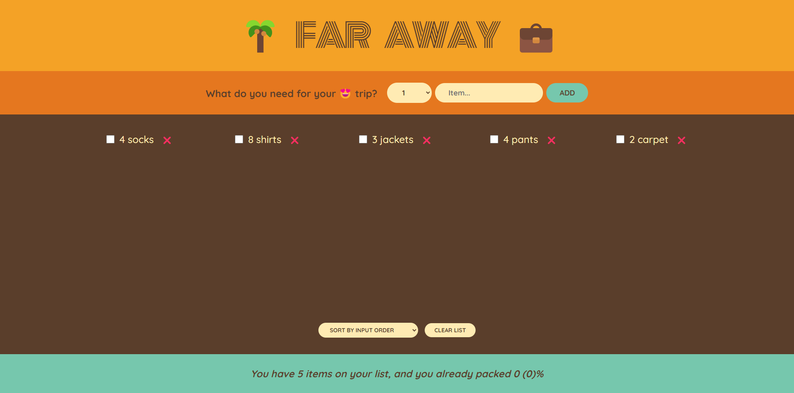

# Travel List React App

>)

## Description

- The Travel List app is a simple and intuitive React application designed to help you manage your packing list for trips. With this app, you can easily add items you need to take with you, track their quantities, and mark them as 'packed' once you're done. The application also allows you to delete items from your list, ensuring that your packing process is organized and stress-free.

- This is a simple practice with state and how to manipulate it.

- This project was bootstrapped with [Create React App](https://github.com/facebook/create-react-app).

## Key Features

- **Add Items**: Effortlessly add items to your travel checklist with their respective quantities.
- **Mark as Packed**: Check off items as you pack them, providing a clear overview of what you've already prepared.
- **Sort Items**: Sort your list by input order, description, or packed status for better organization.
- **Clear List**: Easily remove all items from the list with a confirmation prompt.
- **Stats Overview**: View the total number of items and the percentage packed to keep track of your packing progress.

## Technical Details

This application is built using React and demonstrates various important concepts, including:

- State Management with hooks (`useState`)
- Importing and Exporting components
- Controlled Components for form elements
- Rendering lists and sorting functionality

## Live Demo

- [Live Preview Here](https://travel-list-mo3bassias-projects.vercel.app)
